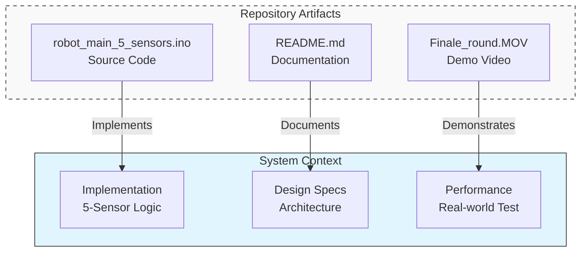

# Autonomous Line Follower Robot 🤖

This project documents an autonomous navigation system built with Arduino. The documentation covers hardware integration, control logic, and system architecture.

## 📘 System Design and Architecture
High-level overview of how the hardware and software components interact.

🔹 [**View Full System Architecture Document**](./SYSTEM_ARCHITECTURE.md)
🔹 [**View Core Control Logic & Algorithms**](./CONTROL_LOGIC.md)

## ⚙️ Hardware and Electronics
Detailed specifications of the physical components and wiring diagrams.

🔹 [**View Hardware Specifications & Pinout**](./HARDWARE_SPECIFICATIONS.md)

## 🚀 Getting Started
Instructions for setting up the robot and running the code.

🔹 **Prerequisites:** Arduino IDE, standard USB cable.

🔹 **Installation:** Clone the repo and upload `robot_main_5_sensors.ino`.

---

### 📂 Repository Contents

## 🔮 Future Roadmap (PID Control)
While the current system uses specific logic states, the next engineering step is implementing **PID Control** (Proportional-Integral-Derivative).
* **Proportional (P):** Steer harder as the error increases.
* **Integral (I):** Correct accumulated errors over time.
* **Derivative (D):** Predict future errors based on rate of change to reduce oscillation.

This repository is organized as follows:

*   `src/` - Main source code files.
*   `docs/` - Detailed documentation files (linked above).
*   `videos/` - Demonstration footage.

*Designed and implemented by [Idan Vimenetz]*

