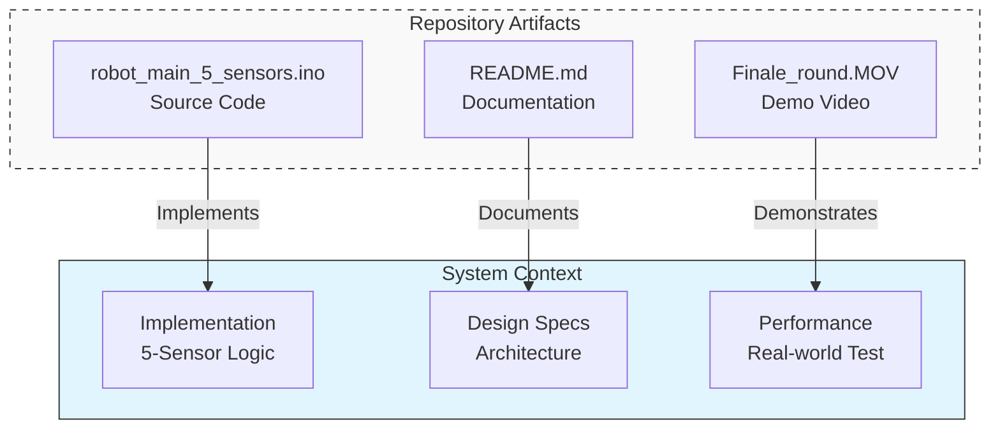

# 🤖 Autonomous Line Follower Robot

  <strong>A high-precision autonomous navigation system using 5-channel IR sensing and differential steering logic.</strong>

---

## 📚 Documentation Hub
Explore the detailed engineering documentation:

| 📘 Architecture & Logic | ⚙️ Hardware & Specs |
| :--- | :--- |
| ➡️ [**System Architecture Overview**](./SYSTEM_ARCHITECTURE.md) _High-level diagrams, HW/SW breakdown_ | ➡️ [**Hardware Specifications**](./HARDWARE_SPECIFICATIONS.md) _Pinout, components, and wiring_ |
| ➡️ [**Control Logic & Algorithms**](./CONTROL_LOGIC.md) _Decision states, state machine, and flow_ | 📄 [**Source Code**](./robot_main_5_sensors.ino) _Main Arduino implementation_ |

---

## ⚡ Key Capabilities
* **Precision Sensing:** 5-channel TCRT5000 IR array for granular line position detection.
* **Smart Navigation:** Differential steering logic handling straight paths, curves, and 90° turns.
* ** robust Control:** Prioritized state machine preventing sensor conflict.
* **Power Management:** Split 7.4V distribution for high-current motors and sensitive logic.

---

## 🚀 Getting Started
1.  **Prerequisites:** Arduino IDE, Standard USB Cable (Type-B).
2.  **Setup:** Clone this repo and open `robot_main_5_sensors.ino`.
3.  **Upload:** Connect Arduino Uno and upload the sketch.
4.  **Run:** Place robot on a black-line track and power on.

---

## 📂 Repository Structure

## 🔮 Future Roadmap (PID Control)
While the current system uses specific logic states, the next engineering step is implementing **PID Control** (Proportional-Integral-Derivative).
🔹 **Proportional (P):** Steer harder as the error increases.
🔹 **Integral (I):** Correct accumulated errors over time.
🔹 **Derivative (D):** Predict future errors based on rate of change to reduce oscillation.

This repository is organized as follows:

 *  `src/` - Main source code files.
 *  `docs/` - Detailed documentation files (linked above).
 *  `videos/` - Demonstration footage.

*Designed and implemented by [Idan Vimenetz]*

