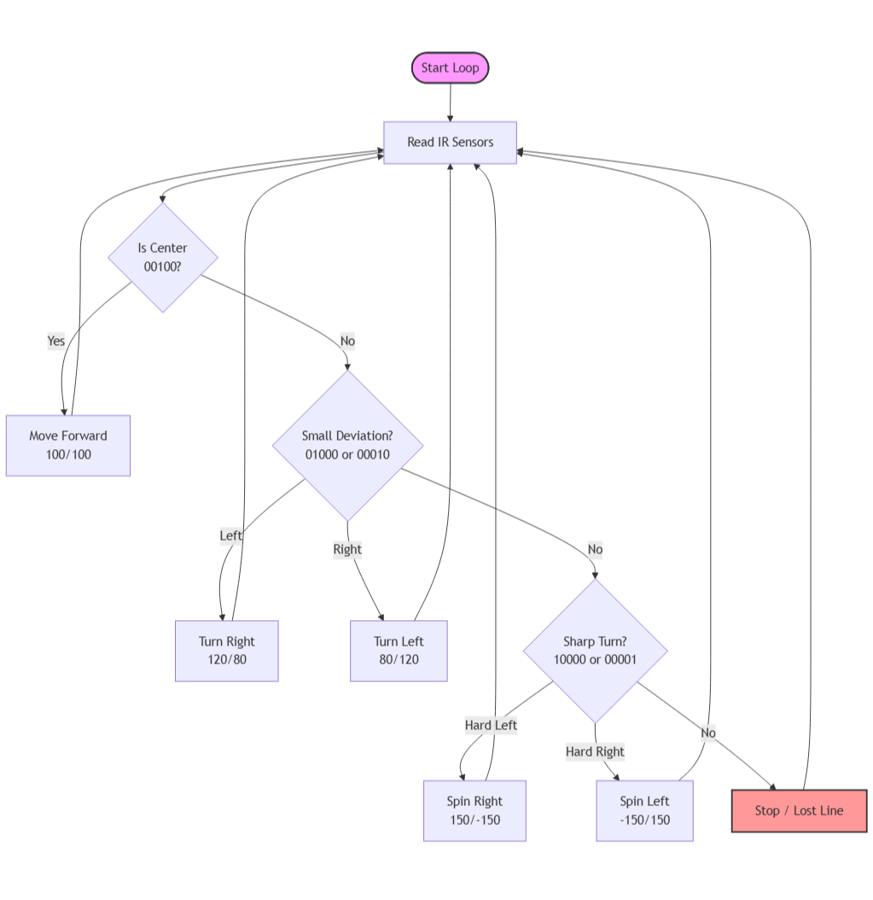

# Core Control Logic & Algorithms

## 🧠 Decision Logic Overview
The robot uses a priority-based logic system. It continuously reads the sensors and enters the first state that matches the input pattern.

## 📊 Sensor States & Actions
The logic interprets the sensor array as a 5-bit binary sequence (Left -> Right).

| Sensor Pattern | State Detected | Action Taken | Motor Speed (L/R) |
|:--------------:|----------------|--------------|:-----------------:|
| `0 0 1 0 0`    | **Center Aligned** | Move Forward | 100 / 100         |
| `0 1 0 0 0`    | Small Deviation| Turn Right   | 120 / 80          |
| `1 0 0 0 0`    | Sharp Turn     | Spin Right   | 150 / -150        |
| `0 0 0 1 0`    | Small Deviation| Turn Left    | 80 / 120          |
| `0 0 0 0 1`    | Sharp Turn     | Spin Left    | -150 / 150        |
| `0 0 0 0 0`    | Line Lost      | Stop         | 0 / 0             |

## ⚙️ Key Algorithms

### 1. Differential Steering
Turning is achieved by varying the speed difference between left and right motors.
* **Concept:** Instead of turning wheels, we spin one side faster than the other.
* **Zero Radius Turn:** In sharp turns, one motor spins forward and the other backward (e.g., 150 / -150) to pivot in place.

### 2. Priority Cascade
The decision logic evaluates conditions in a specific order to prevent conflicts:
1.  **Check Center:** Are we aligned? -> Go Straight.
2.  **Check Small Error:** Are we slightly off? -> Correct gently.
3.  **Check Big Error:** Are we about to lose the line? -> Correct aggressively.

This ensures that the robot reacts to the most critical information first.
