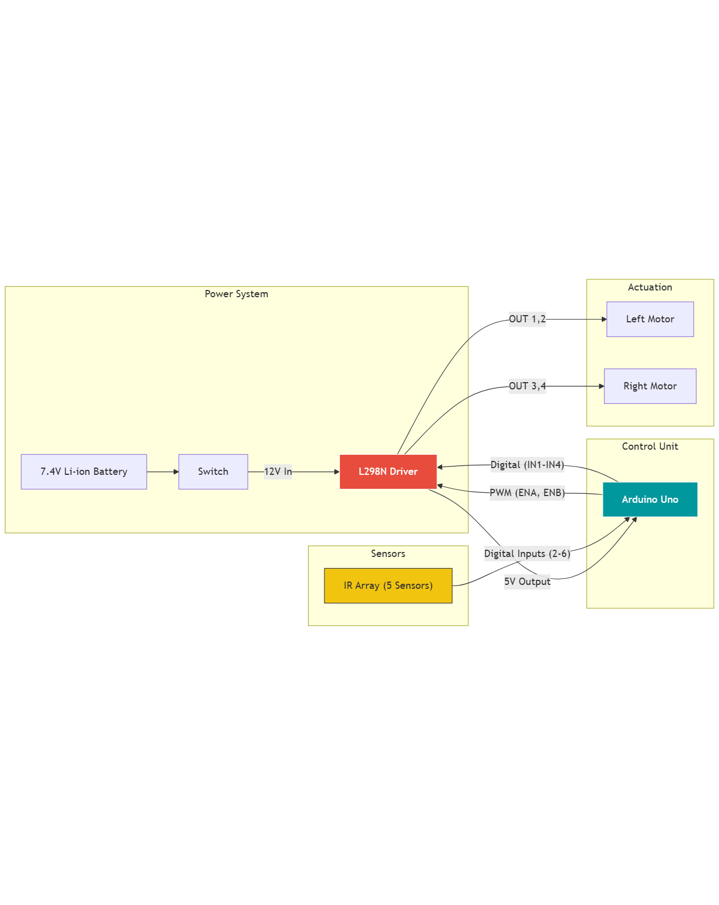

# Hardware Specifications & Pinout

## 🔌 Wiring & Connections Overview
The following diagram illustrates the high-level wiring between the Power Unit, MCU, Motor Driver, and Sensors.

## 🛠 Component List
| Component | Model/Specs | Quantity | Function |
|-----------|-------------|:--------:|----------|
| **MCU** | Arduino Uno R3 | 1 | Main processing unit |
| **Driver** | L298N Dual H-Bridge | 1 | Controls motor direction & speed |
| **Motors** | DC Gearbox Motor (TT) | 2 | Drive system (3-6V) |
| **Sensors** | TCRT5000 5-CH Array | 1 | Line detection (IR reflection) |
| **Power** | 7.4V Li-ion (18650 x2) | 1 | Main power source |
| **Chassis** | Acrylic 2WD Platform | 1 | Structural base |

## 📌 Pinout Configuration (Arduino Mapping)
This mapping defines how the code interacts with the physical hardware.

### Motor Driver (L298N)
| Arduino Pin | L298N Pin | Function |
|:-----------:|:---------:|----------|
| `9` | ENA | PWM Speed Control (Left) |
| `10` | ENB | PWM Speed Control (Right) |
| `8` | IN1 | Left Motor Direction A |
| `11` | IN2 | Left Motor Direction B |
| `12` | IN3 | Right Motor Direction A |
| `13` | IN4 | Right Motor Direction B |

### Sensor Array (Left to Right)
| Arduino Pin | Sensor Position | Variable Name |
|:-----------:|:---------------:|---------------|
| `2` | Far Left | `S1` |
| `3` | Near Left | `S2` |
| `4` | Center | `S3` |
| `5` | Near Right | `S4` |
| `6` | Far Right | `S5` |

## 🔋 Power Management
* **Voltage Regulation:** The L298N includes a built-in 5V regulator which powers the Arduino via the `Vin` pin (or USB logic power).
* **Safety:** A master switch is installed between the battery positive terminal and the driver input.
