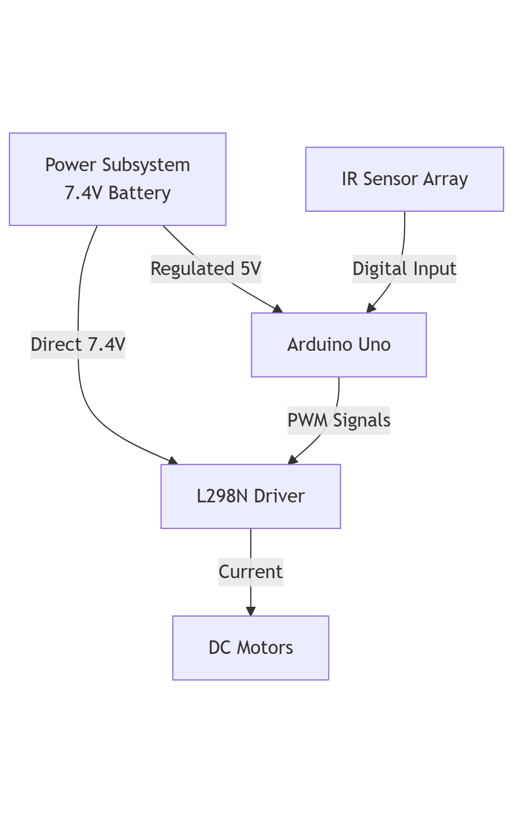
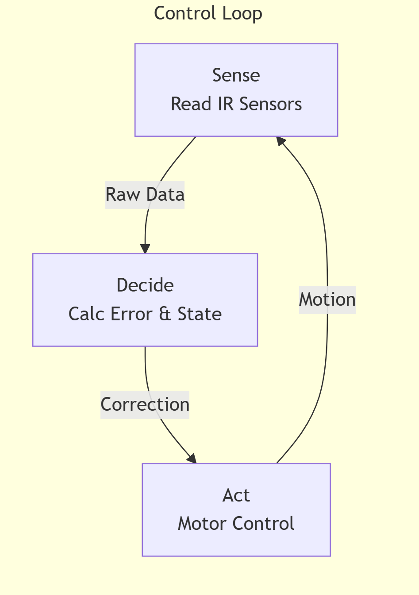

# System Architecture Overview

This document details the high-level architecture of the Autonomous Line Follower.

## Hardware Architecture
The system is built on a layered architecture separating power, control, and actuation.

## Software Architecture
The control software implements a continuous sense-decide-act loop structure.

